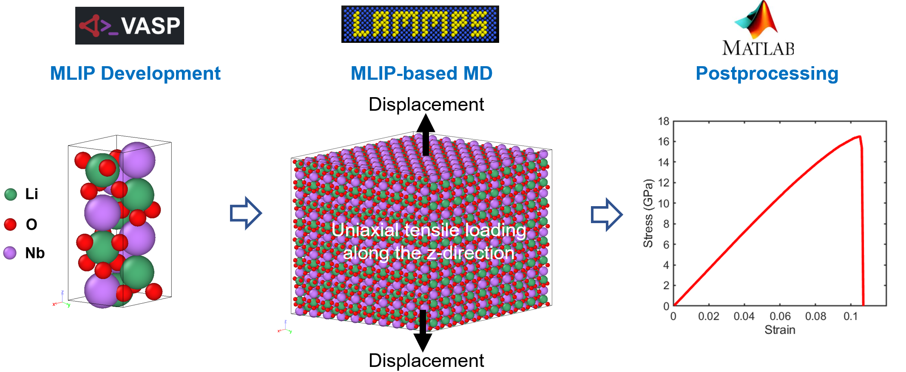

## Overview
This repository provides an end-to-end framework for developing DFT-trained machine-learning interatomic potentials for lithium niobate (LiNbO₃), using VASP on-the-fly learning, and their application to large-scale simulations using LAMMPS.

  

  <em>
  End-to-end workflow for MLIP-based mechanical modeling of LiNbO₃:
  DFT data generation (VASP) → MLIP-accelerated molecular dynamics (LAMMPS) →
  stress–strain postprocessing.
  </em>

## Validation

Validation is performed at multiple levels. First, consistency with DFT is assessed by
monitoring energies and forces during VASP on-the-fly learning and by verifying stable
behavior on configurations not explicitly included in the training set. Second, the
trained MLIP is validated against physically measurable properties—including equilibrium
lattice parameters, thermal expansion, and elastic response—using finite-temperature
MLIP-based molecular dynamics simulations.

As shown in the validation results below, the MLIP reproduces the experimental lattice
constants at finite temperature and captures both the anisotropy and magnitude of the
thermal expansion coefficients along the *a*, *b*, and *c* crystallographic directions.

---

**Funding:**  
This research was supported by the **Defense Advanced Research Projects Agency (DARPA)**
under the **CRYSTAL ARC** program.

